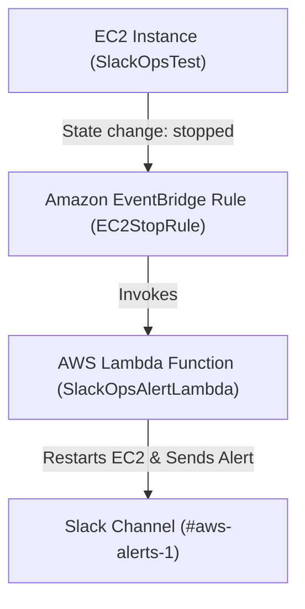

,

# AWS SlackOps — Serverless Alerting & Auto-Remediation System

A fully automated **serverless incident-response pipeline** built on AWS.  
It detects EC2 instance stoppage events via **Amazon EventBridge**, triggers a **Lambda** function for **auto-remediation**, and sends real-time alerts to a **Slack channel**.

---

## Architecture Diagram

---

## Tech Stack

| Component               | Purpose                                          |
| ----------------------- | ------------------------------------------------ |
| **AWS Lambda**          | Executes remediation logic & Slack notifications |
| **Amazon EventBridge**  | Detects EC2 stop events                          |
| **Slack Webhook**       | Receives real-time alerts                        |
| **IAM Role**            | Grants Lambda logging & EC2 permissions          |
| **Python 3.12 + Boto3** | Implements logic using AWS SDK                   |

---

## Workflow Summary

1️⃣ **EC2 instance stops** — triggers a state change.  
2️⃣ **EventBridge** detects the `stopped` state and matches it against the rule.  
3️⃣ **EventBridge** invokes the **Lambda** function.  
4️⃣ **Lambda** restarts the EC2 instance and posts a Slack alert to `#aws-alerts-1`.  

---

## Testing the Pipeline

### Manual Invocation (via AWS CLI)
You can manually invoke the Lambda function using a sample event payload to validate both remediation and Slack alert delivery:

``bash
aws lambda invoke \
  --region us-west-2 \
  --function-name SlackOpsAlertLambda \
  --payload fileb://test-event.json \
  response.json

──────────────────────────────────────
DEPLOYMENT ✔️
──────────────────────────────────────

**Status:** Functional ✅  
**Region:** us-west-2  
**Webhook Verified:** :white_check_mark: SlackOps test message delivered successfully  
**Lambda → EventBridge Integration:** Established and confirmed  

---

## 📸 Project Demonstration — AWS SlackOps (Automated Incident Response)

This section showcases the end-to-end automation workflow connecting **AWS EC2**, **EventBridge**, **Lambda**, and **Slack**.

| Screenshot | Description |
|-------------|--------------|
|  | **Lambda Function – SlackOpsAlertLambda** Configured to trigger on EC2 stop events and forward alerts to Slack. |
|  | **IAM Role – SlackOpsLambdaRole** Grants Lambda permissions for EC2 and CloudWatch access. |
|  | **EventBridge Rule** CLI output confirming the rule *EC2StopRule* listening for EC2 “stopped” events. |
|  | **CloudWatch Logs** Execution logs verifying Lambda was triggered and Slack message sent successfully. |
|  | **Slack Alert Channel – #aws-slackops** Received real-time notification: “:rotating_light: EC2 instance stopped – Auto-remediation triggered.” |
|  | **Architecture Overview** EC2 → EventBridge → Lambda → Slack Webhook pipeline for automated incident alerts. |

---

| Badge | Description |
|-------|--------------|
|  | Core execution logic |
|  | Detects EC2 stop events |
|  | Sends real-time alerts |
|  | Lambda runtime |
|  | Current project state |
