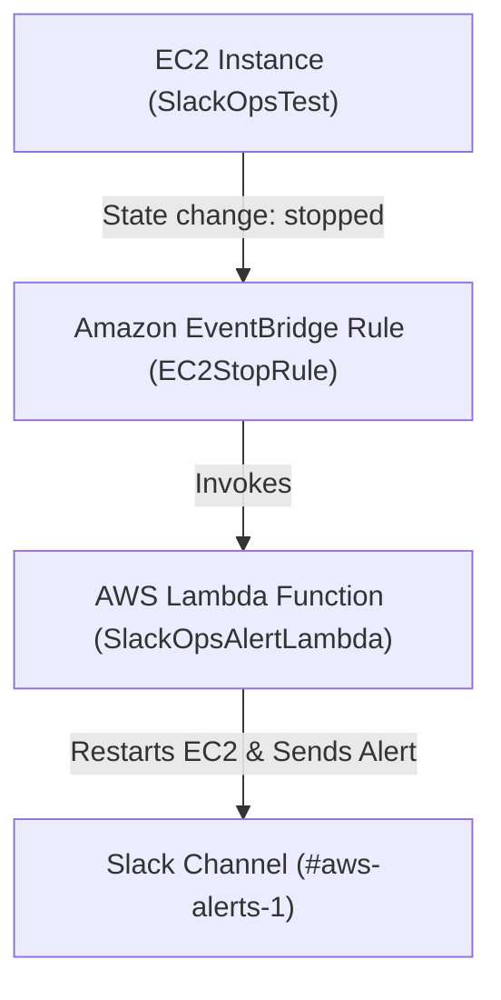

cat > README.md <<'EOF'
# AWS SlackOps — Serverless Alerting & Auto-Remediation System

A fully automated **serverless incident-response pipeline** built on AWS.  
It detects EC2 instance stoppage events via **Amazon EventBridge**, triggers a **Lambda** function for **auto-remediation**, and sends real-time alerts to a **Slack channel**.

---

## 🏗 Architecture Diagram



---

## ⚙️ Tech Stack

| Component               | Purpose                                          |
| ----------------------- | ------------------------------------------------ |
| **AWS Lambda**          | Executes remediation logic & Slack notifications |
| **Amazon EventBridge**  | Detects EC2 stop events                          |
| **Slack Webhook**       | Receives real-time alerts                        |
| **IAM Role**            | Grants Lambda logging & EC2 permissions          |
| **Python 3.12 + Boto3** | Implements logic using AWS SDK                   |

---

## 🧠 Workflow Summary

1️⃣ **EC2 instance stops** — triggers a state change.  
2️⃣ **EventBridge** detects the `stopped` state and matches it against the rule.  
3️⃣ **EventBridge** invokes the **Lambda** function.  
4️⃣ **Lambda** restarts the EC2 instance and posts a Slack alert to `#aws-alerts-1`.  

---

## 🧪 Testing the Pipeline

### 1. Manual Invocation (via AWS CLI)
You can manually invoke the Lambda function using a sample event payload to validate both remediation and Slack alert delivery:

````bash
aws lambda invoke \
  --region us-west-2 \
  --function-name SlackOpsAlertLambda \
  --payload fileb://test-event.json \
  response.json
